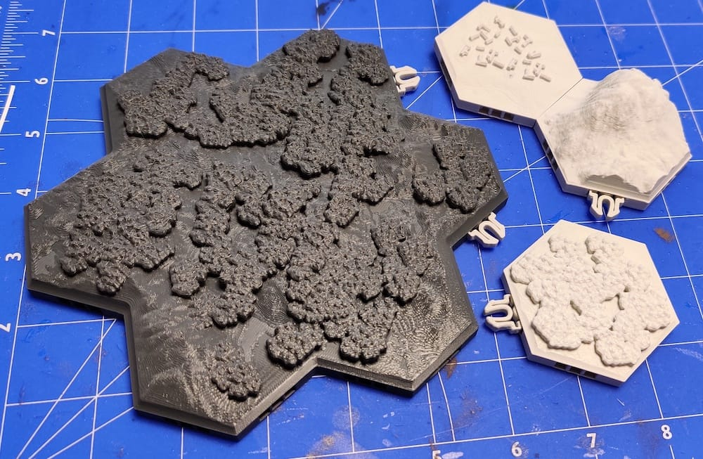
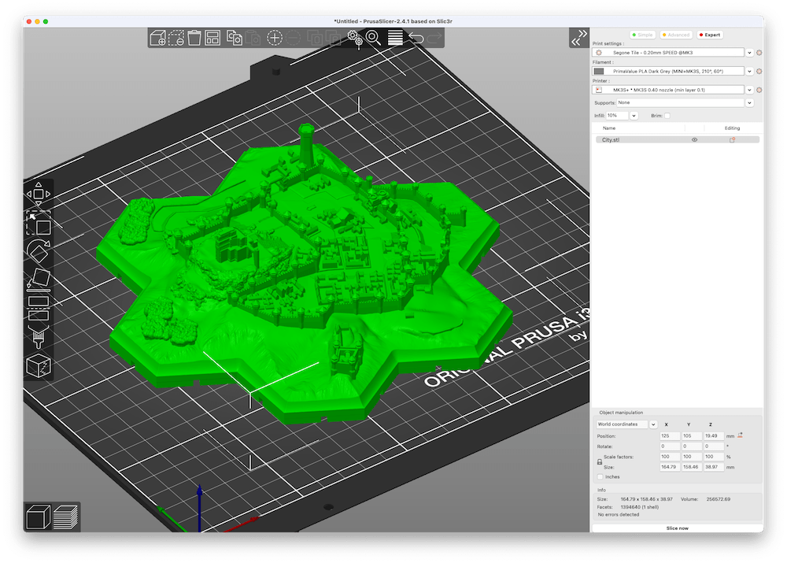
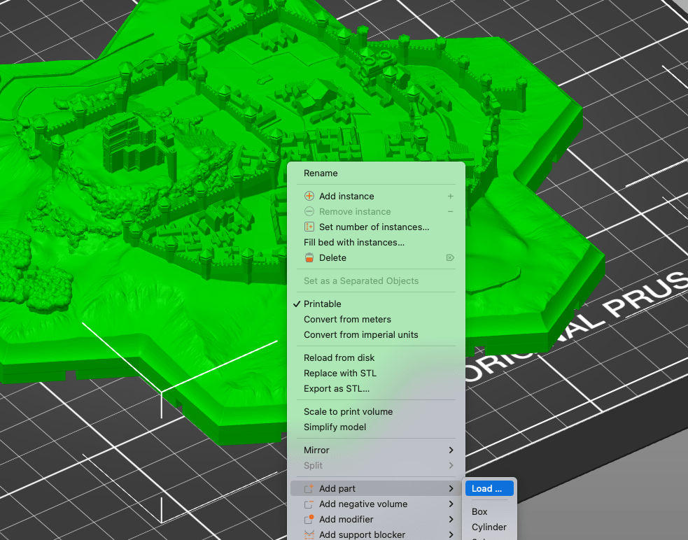
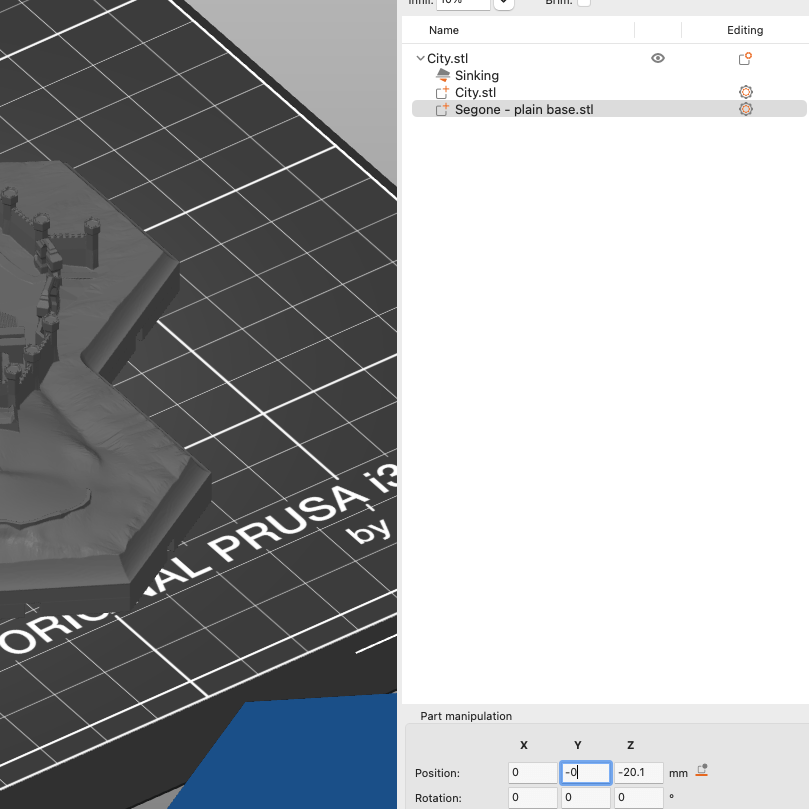
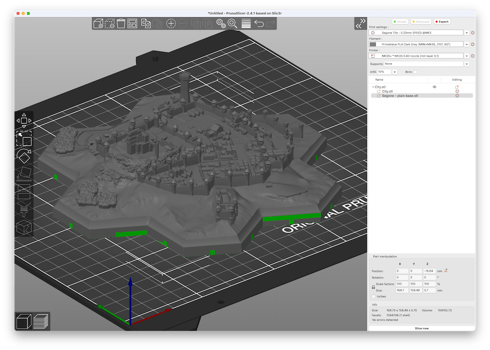
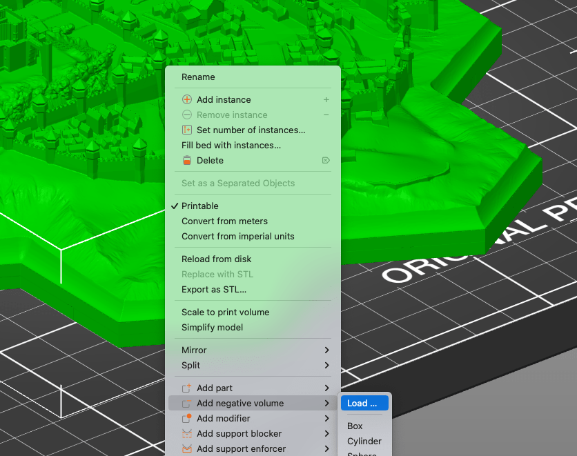
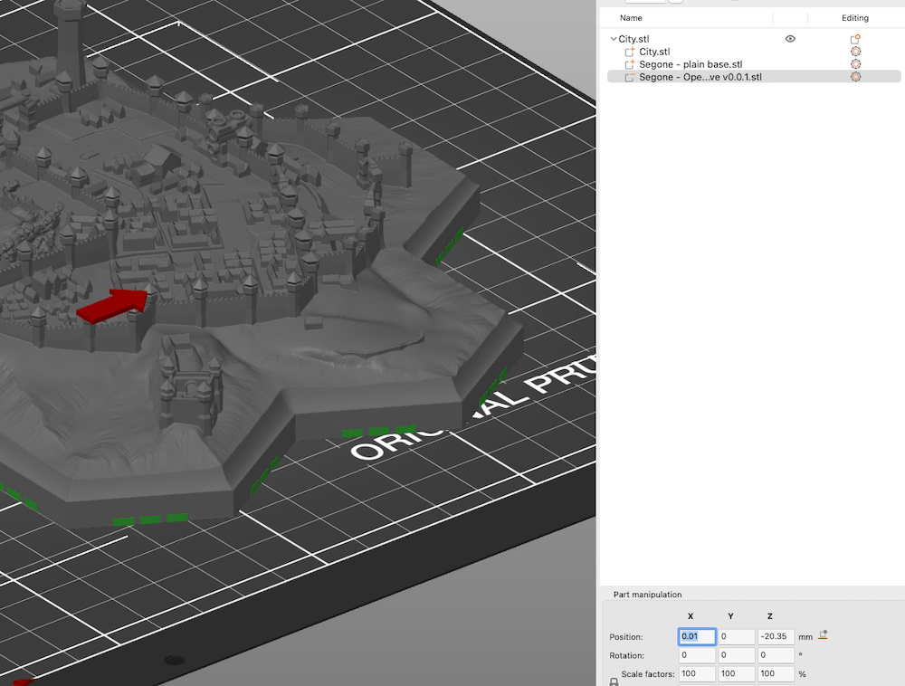
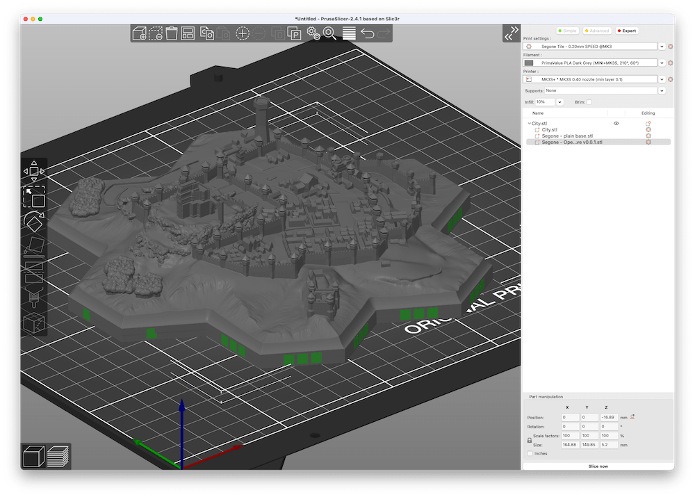
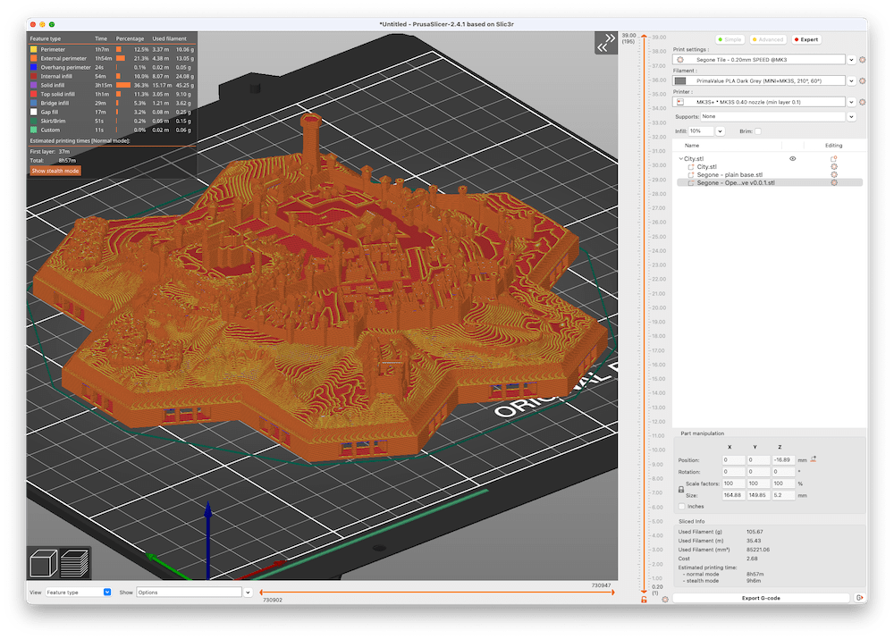
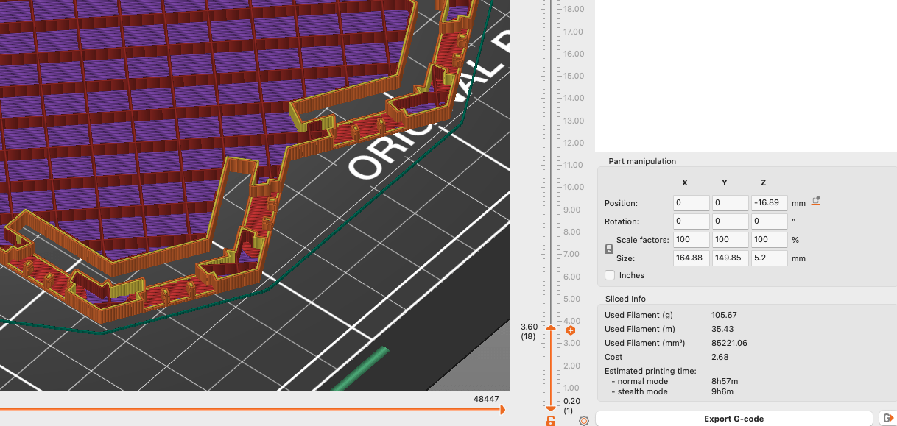

# Mods for Segone "show them your world" 

## About

These instructions show how you can modify Segone tiles to reflect your personal preferences.

Please support Simon's awesome
<a href="https://www.kickstarter.com/projects/segonefantasystl/segone-show-them-your-world-stl-and-pdf-fantasy-map" target="_blank">Segone: show them your world (stl and pdf fantasy map)</a> campaign 
on 
<a href="https://www.kickstarter.com/projects/segonefantasystl/segone-show-them-your-world-stl-and-pdf-fantasy-map" target="_blank">Kickstarter</a>!

## Replace original "H" connectors by OpenLOCK clipping

### 0. Prerequisites

- Install latest version of [PrusaSlicer](https://www.prusa3d.com/page/prusaslicer_424/)

### 1. Load Segone tile

### 2. Add solid mod part

   > Note: This is to remove the original "H" holes

Right-click the model and select "Add part" > "Load ..." 

Select the file [`openlock/segone_solid-base.stl`](./openlock/segone_solid-base.stl)
   
### 3. Align the solid mod part

- Overwrite the position of the just added part by setting both it's x- and y-position to 0
- Align z-position to the ground by clicking the "Drop to bed" icon

It should now look like this:

### 4. Add negative mod part

   > Note: This is to cut out the OpenLOCK holes

Right-click the model and select "Add negative volume" > "Load ..." 
   

   
Select the file [`openlock/segone_openlock-negative.stl`](./openlock/segone_openlock-negative.stl)

### 5. Align the negative mod part

- Overwrite the position of the just added part by setting both it's x- and y-position to 0
- Align z-position to the ground by clicking the "Drop to bed" icon
   

It should now look like this:

### 6. Slice and double-check

Hit the "Slice now" button and double check the result:

### 7. Print it and have fun!

:smiley:

## Credits

All <a href="https://www.kickstarter.com/projects/segonefantasystl/segone-show-them-your-world-stl-and-pdf-fantasy-map" target="_blank">"Segone: show them your world (stl and pdf fantasy map)"</a> designs are copyrighted and the intellectual property of Simon Bertrand ("Stressed_Racoon" / "The Raccoon Brotherhood"):

<a href="https://www.kickstarter.com/projects/segonefantasystl/segone-show-them-your-world-stl-and-pdf-fantasy-map/creator_bio" target="_blank">Stressed_Racoo @ Kickstarter</a>

<a href="https://www.facebook.com/TheRaccoonBrotherhood" target="_blank">The Raccoon Brotherhood @ Facebook</a>

 

The OpenLOCK system was created by [Printablescenery](https://www.printablescenery.com/product/open-lock/).

## License

 Licensed under <a rel="license" href="http://creativecommons.org/licenses/by-sa/4.0/">Creative Commons Attribution-ShareAlike 4.0 International License</a>.

The OpenLOCK system is used under the BSD license: [Printablescenery OpenLOCK license](https://www.printablescenery.com/2021/03/17/openvlex-2/)
